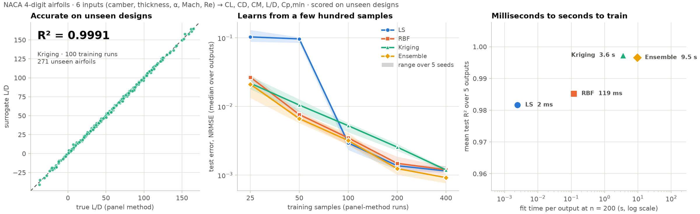

# ddmo

[](https://github.com/Ahmed-Bayoumy/ddmo/actions/workflows/lx-build-and-tests.yml)
[](https://github.com/Ahmed-Bayoumy/ddmo/actions/workflows/macos-build-and-pytest.yml)
[](https://github.com/Ahmed-Bayoumy/ddmo/actions/workflows/win-build-and-pytest.yml)
[](https://github.com/Ahmed-Bayoumy/ddmo/actions/workflows/docs.yml)
[](https://ahmed-bayoumy.github.io/ddmo/)

📖 **Documentation:** <https://ahmed-bayoumy.github.io/ddmo/>

**Data-Driven Models for Optimization** — data-fit models built on NumPy and SciPy.

<picture>
  <source media="(prefers-color-scheme: dark)" srcset="docs/figures/readme/showcase_dark.png">
  
</picture>

**Swap an expensive simulation for a surrogate trained on a few hundred runs.** On a NACA 4-digit
airfoil study (6 inputs: camber, thickness, angle of attack, Mach, Reynolds number):

- 🎯 **Accurate on unseen designs:** trained on only **100** panel-method runs, Kriging predicts the
  lift-to-drag ratio of **271 unseen airfoils with R² = 0.999**.
- 📉 **Sample-efficient:** median test error falls about **20×** from 25 to 400 training runs.
  With 200 runs, every model reaches a median R² ≥ 0.9998 on lift, drag, moment and L/D.
- ⚡ **Fast to train:** at 200 runs, a fit takes **2 ms** (LS), **0.1 s** (RBF) or **3.5–10 s**
  (Kriging, ensemble) per output, with one interface for all four.
- 🔬 **Benchmarked, not promised:** across seven engineering problems and 4080 fits, Kriging and the
  ensemble meet strict accuracy criteria on 33 of 51 outputs. See the
  [benchmark results](https://ahmed-bayoumy.github.io/ddmo/benchmark_results.html).

<sub>Figure: <code>python BM/showcase.py</code> (5 seeds, tuned settings per model; fit times measured with 24 fits in parallel).</sub>

`ddmo` fits cheap approximations of expensive functions (simulations, experiments) from a
set of samples, so an optimizer can query the surrogate instead of the true function.
All models share one scikit-learn-style interface: `fit(X, y)`, `predict(X)`, `score(X, y)`.

| Model | Class | Use it when |
|---|---|---|
| Polynomial least squares | `LS` | You want a smooth global trend or a response surface (degree 1–3), the data is noisy, or you want lasso to pick out the important inputs. |
| Radial basis functions | `RBF` | You want an interpolant that passes through every sample and is fast to fit. |
| Kriging (Gaussian process) | `Kriging` | You also need an uncertainty estimate, e.g. for expected improvement. |
| Weighted ensemble | `WeightedEnsemble` | You want to average several models, optionally weighted by cross-validation error. |

## Installation

Requires Python 3.9+, NumPy and SciPy.

```bash
pip install git+https://github.com/Ahmed-Bayoumy/ddmo.git
```

For development:

```bash
git clone https://github.com/Ahmed-Bayoumy/ddmo.git
cd ddmo
pip install -e ".[test]"
pytest
```

## Quick start

```python
import numpy as np
from ddmo import Kriging

rng = np.random.default_rng(0)
X = rng.uniform(-1, 1, size=(40, 2))          # 40 samples, 2 inputs
y = np.sin(3 * X[:, 0]) + X[:, 1] ** 2

model = Kriging().fit(X, y)

X_new = np.array([[0.2, -0.4], [0.9, 0.9]])
mean, std = model.predict(X_new, return_std=True)
print(mean, std)
print("R^2 on training data:", model.score(X, y))
```

`X` is always a 2-D array of shape `(n_samples, n_features)`; `y` is 1-D (a single output).
Inputs are standardized internally using the training data (`normalize=True` by default),
and NaN or infinite values are rejected.

## Models

### `LS` — polynomial least squares

```python
from ddmo import LS

LS(degree=2)                     # full quadratic: 1, x0, x1, x0^2, x0*x1, x1^2
LS(degree=3, ridge=1e-3)         # cubic with ridge (L2) regularization
LS(degree=2, lasso="auto")       # quadratic with lasso (L1), strength chosen by CV
LS(lasso=1.0, ridge=0.1)         # elastic net
```

The fitted coefficients minimize

    1/2 ||y - A w||^2 + ridge/2 ||w||^2 + lasso ||w||_1

where `A` is the polynomial basis with each non-constant column scaled to unit standard
deviation (so every term is penalized equally) and the intercept is never penalized.

- `degree`: total polynomial degree, including interaction terms. `degree=0` fits a constant.
- `ridge`: L2 penalty. Shrinks coefficients smoothly; useful for noisy or correlated data.
- `lasso`: L1 penalty. Sets the coefficients of uninformative terms exactly to zero, so the
  model also performs feature selection. `"auto"` picks the value from a path of `n_lassos`
  candidates by `n_folds`-fold cross-validation (see `lasso_`, `lasso_path_`, `cv_mse_`).
- Penalties are summed over samples, so a given value is relatively weaker with more data.

After fitting, `support_` is a boolean mask of the inputs used by at least one nonzero
term and `selected_features_` lists their indices:

```python
rng = np.random.default_rng(1)
X8 = rng.normal(size=(80, 8))
y8 = 3 * X8[:, 0] - 2 * X8[:, 3] + 0.01 * rng.normal(size=80)

LS(lasso=5.0).fit(X8, y8).selected_features_   # array([0, 3])
```

With `lasso=0` (the default) the model is solved with `numpy.linalg.lstsq`, so it stays
stable when there are fewer samples than terms (it returns the minimum-norm solution).
With `lasso > 0` it is solved by coordinate descent (`max_iter`, `tol`).

### `RBF` — radial basis function interpolation

```python
from ddmo import RBF

RBF(kernel="cubic")                   # no shape parameter to tune
RBF(kernel="gaussian", gamma="auto")  # shape parameter chosen by leave-one-out CV
```

The interpolant is `s(x) = Σ wᵢ φ(γ‖x − xᵢ‖) + q(x)`, where `q` is a polynomial tail.

| `kernel` | φ(r) | Default tail degree |
|---|---|---|
| `gaussian` | exp(−(γr)²) | 0 |
| `inverse_multiquadric` | 1 / √(1 + (γr)²) | 0 |
| `multiquadric` | √(1 + (γr)²) | 0 |
| `linear` | r | 0 |
| `cubic` | r³ | 1 |
| `thin_plate` | r² log r | 1 |

- `gamma`: shape parameter (larger = more localized). Ignored by `linear`, `cubic` and
  `thin_plate`. `"auto"` selects it with Rippa's closed-form leave-one-out error, skipping
  values whose linear system is ill-conditioned.
- `degree`: polynomial tail degree. `None` uses the default above; each kernel has a
  minimum degree that guarantees a unique solution (1 for `cubic`/`thin_plate`), and
  `degree=-1` (no tail) is allowed only for `gaussian` and `inverse_multiquadric`.
- `regularization`: added to the kernel diagonal. Increase it to smooth noisy data.

### `Kriging` — ordinary kriging

```python
from ddmo import Kriging

model = Kriging().fit(X, y)          # theta estimated by maximum likelihood
model.theta_                         # one correlation parameter per input dimension
mean, std = model.predict(X_new, return_std=True)
```

Correlation: `R(x, x') = exp(−Σₖ θₖ |xₖ − x'ₖ|^p)`.

- `theta`: `None` (default) estimates one θₖ per dimension by maximizing the concentrated
  likelihood (multi-start L-BFGS-B within `theta_bounds`). Pass a number or an array to fix it.
  A small fitted θₖ means the model found input `k` to have little influence.
- `p`: smoothness exponent, `0 < p ≤ 2` (`2` = Gaussian).
- `nugget`: diagonal jitter. It is increased automatically if the correlation matrix is not
  numerically positive definite.
- `n_restarts`, `random_state`: control the likelihood optimization.

`predict(X, return_std=True)` returns the kriging standard error, which is zero at the
training points and grows away from them. Fitted values include `beta_` (the constant mean)
and `sigma2_` (the process variance).

### `WeightedEnsemble` — model averaging

```python
from ddmo import LS, RBF, WeightedEnsemble

ens = WeightedEnsemble(experts=[LS(degree=2), RBF(kernel="cubic")], weights="cv").fit(X, y)
ens.weights_   # normalized weights
ens.cv_mse_    # cross-validation MSE of each expert (weights="cv" only)
```

- `weights`: `None`/`"uniform"`, `"cv"` (proportional to 1 / k-fold CV error), or a list of
  non-negative numbers, one per expert.
- `n_folds`, `random_state`: control the cross-validation.

The weights are the same everywhere in the input space (there is no gating network).
The experts are fitted in place, so you can inspect them after fitting.

## Feature selection

`ddmo.feature_selection` detects inputs that are collinear or carry no information, so you
can drop them before fitting. Constant columns are always dropped.

```python
from ddmo import CollinearityFilter, feature_selection

rng = np.random.default_rng(2)
a, b, c = rng.normal(size=(3, 100))
Xc = np.column_stack([a, b, a + b, c])        # column 2 is a combination of 0 and 1
yc = a - c

feature_selection.variance_inflation_factors(Xc)   # [inf, inf, inf, ~1.0]
feature_selection.vif_filter(Xc, threshold=10)     # array([0, 1, 3])
feature_selection.correlation_filter(Xc, 0.95)     # pairwise |corr| filter
feature_selection.lasso_select(Xc, yc)             # inputs kept by LS(lasso="auto")

filt = CollinearityFilter(method="vif").fit(Xc)    # or method="correlation"
filt.selected_features_, filt.dropped_features_    # [0, 1, 3], [2]
model = Kriging().fit(filt.transform(Xc), yc)      # use the same filter on new data
model.predict(filt.transform(Xc[:5]))
```

| Function | Drops a feature when |
|---|---|
| `correlation_filter(X, threshold=0.95)` | its absolute correlation with an already kept feature exceeds `threshold` (pairwise only). |
| `vif_filter(X, threshold=10)` | it has the largest variance inflation factor and that VIF exceeds `threshold`; repeated until none do. Catches a feature that is a combination of several others. |
| `lasso_select(X, y, lasso="auto", **ls_params)` | its lasso coefficient is zero, i.e. it does not help predict `y`. |

Ties are resolved in favour of earlier columns. `CollinearityFilter` stores the result
(`support_`, `selected_features_`, `dropped_features_`) and applies it with `transform`.

## Gradients

Every model provides the analytic gradient of its prediction with respect to the inputs,
which you can pass to gradient-based optimizers:

```python
from scipy.optimize import minimize

model = Kriging().fit(X, y)

grad = model.predict_gradient(X_new)   # shape (n_samples, n_features), in original input units

res = minimize(
    lambda x: model.predict(x[None, :])[0],
    x0=np.zeros(2),
    jac=lambda x: model.predict_gradient(x[None, :])[0],
    bounds=[(-1, 1), (-1, 1)],
)
```

Gradients account for the internal input normalization, so they are always with respect to
the inputs as you passed them. The `linear` and `thin_plate` RBF kernels, and Kriging with
`p <= 1`, are not differentiable exactly at training points; the gradient contribution there
is taken as 0.

## Metrics

```python
from ddmo import metrics

metrics.mse(y_true, y_pred)
metrics.rmse(y_true, y_pred)
metrics.r2(y_true, y_pred)
```

`model.score(X, y)` returns R².

## Plotly dashboard (frontend)

The repository now keeps frontend and backend app code in separate modules:

- `src/ddmo_backend`: data loading, model construction, train/test split, and metric evaluation.
- `src/ddmo_frontend`: Dash + Plotly UI for interactive model training and diagnostics.

Install the UI extra and launch the dashboard:

```bash
pip install -e ".[ui]"
ddmo-dashboard
```

In the dashboard, you can:

- upload CSV data,
- choose target and feature columns,
- select a model (`LS`, `RBF`, `Kriging`, or `Weighted Ensemble`),
- tune model hyperparameters,
- train/evaluate with a train-test split,
- inspect predicted-vs-actual and residual plots,
- review model quality metrics (`R²`, `RMSE`, `MSE`) in a table,
- download any trained model as a `.pkl` file ("Export trained model").

## Saving and loading models

Fitted models can be saved and reused later without retraining. Files are written with
`pickle`, the same approach scikit-learn uses for persisting estimators, and also record
the feature names, target name, ddmo version and any metadata you pass.

```python
from ddmo import Kriging, load_model, save_model

model = Kriging().fit(X_train, y_train)
save_model(model, "kriging.pkl", feature_names=["x1", "x2"], target_name="f")

bundle = load_model("kriging.pkl")
bundle.predict(X_new)          # NumPy array, or a DataFrame with the named columns
bundle.predict_gradient(X_new)
bundle.metadata                # e.g. hyperparameters and metrics for dashboard exports
```

Only load model files you trust: unpickling can run arbitrary code. `load_model` warns
when the file was saved with a different ddmo version.

## Benchmarking

`BM/benchmark.py` benchmarks every model on the seven engineering datasets in
[`BM/datasets`](BM/datasets/README.md). Each fit uses a random training subsample (one per seed)
at several training-set sizes, and is scored on the fixed test split. All fits
run in parallel, one process per core.

```bash
pip install -e ".[bench]"
python BM/benchmark.py            # 5 seeds x sizes 50/100/200, all cores
python BM/benchmark.py --quick    # smoke test, about a minute
python BM/benchmark.py --train-sizes 50 100 200 400   # adds n=400: about 2 h on 24 cores
python BM/benchmark.py --help     # datasets, models, seeds, sizes, thresholds, --strict
```

Each output passes when the median over seeds at the largest size meets
R² ≥ 0.90, NRMSE ≤ 0.10 and NMAX ≤ 0.30. Results go to `BM/results/`:

- `report.md` with the pass matrix and failing outputs
- CSV files with raw and aggregated metrics
- plots: learning curves (mean, median and a ±1 s.d. band), box plots per output, a pass matrix and an R² overview

## Name aliases

`LinearSurrogate`, `RBFSurrogate`, `KrigingSurrogate`, `MixtureOfExperts` and `MOE` are
aliases of `LS`, `RBF`, `Kriging` and `WeightedEnsemble`. The RBF kernel names
`multiquadratic`, `inverse_multiquadratic` and `absolute` are deprecated in favour of
`multiquadric`, `inverse_multiquadric` and `linear`.

## Limitations

- Single-output models only.
- Gradients are available for the prediction, but not for the Kriging standard error.
- Kriging and RBF build dense `n × n` matrices, so they suit up to a few thousand samples.

## License

GPL-3.0-or-later. See [LICENSE](LICENSE).
